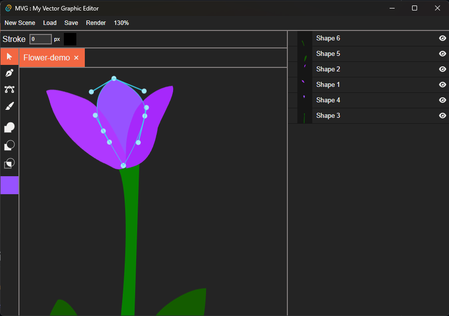

# MVG : My Vector Graphic Editor

This project is a vector graphic editor. It is a personal project to learn more about Rust, WebAssembly and Angular. At the start, this project was a simple vector graphic editor with a focus on boolean operation on path. The idea was that when a user draw a shape it could automatically insert the shape with the other shape on the canvas and creating a continuous shape. It would made the neccessary union and difference operation to make the shape continuous.

Some times later, after some complication, I phased out this idea and focused on simple shape.  

Now, I am a student, I worked on it for a year and a half and I am kinda tired of this project so here the result of my work.

## Features

- Canvas movement with zoom, pan, rotation and flip
- Inserting circle shape
- Inserting and merging circle shape into a existing shape
- Moving points of any shape
- Changing the color of the shape
- Changing the stroke width and color of the shape
- Edit bezier curve handle
- Boolean operation on shapes
- Inserting points in a shape
- Changing layer order
- Loading and saving the canvas
- Exporting the canvas to a PNG file
- Undo and redo
- Some bugs and glitches

### What is missing

- Inserting different shape
- Changing the size of the inserted shape
- Moving bezier handle automatically with the point
- GPU rendering, I mean would be nice to not use the canvas2d API but use WebGL or WebGPU (I got no experience with this)
- The continuous shape idea
- Transforming the the full shape and not individual point
- Better stoke than simple width and color
- Saving directly to a file in the desktop version
- More performance for the boolean operation
- Unselecting a shape without using Esc
- And many more

## Demo

## Building

### Dependencies

- Rust with cargo
- cargo-make
- cargo-watch
- wasm-pack
- tauri (1.4)
- Node.js
- Angular cli
  
### Serve for development

``cargo make serve``

It will serve the web app at http://localhost:4200

### Build for production

#### Web

``cargo make build-web``

#### Desktop

``cargo make build-desktop``

### Others

See Makefile.toml at the project root for others commands and details.

## Other tools

### Tests

``cargo make test-all``

